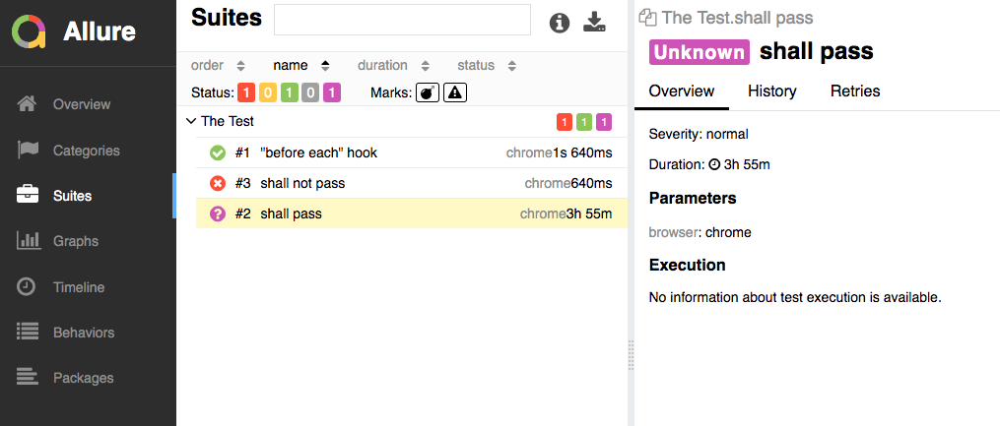
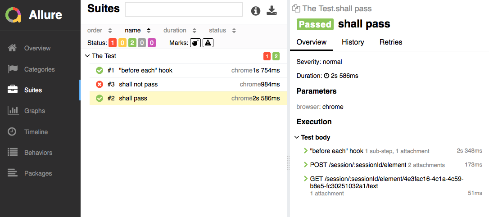

# Issue

Allure doesn't correctly report 'passing' tests starting with `@wdio/allure-reporter` version `5.16.10`

## Steps to Reproduce

1. Clone this repo
2. Run `npm i`
3. Run the test: `npm test`
4. Run allure report: `npm run allure`

Incorrect output (the `?` should be a green checkmark with steps in detail pane):

## Steps to show expected output

1. Run `npm i @wdio/allure-reporter@5.16.0`
2. Run steps 3 & 4 above

